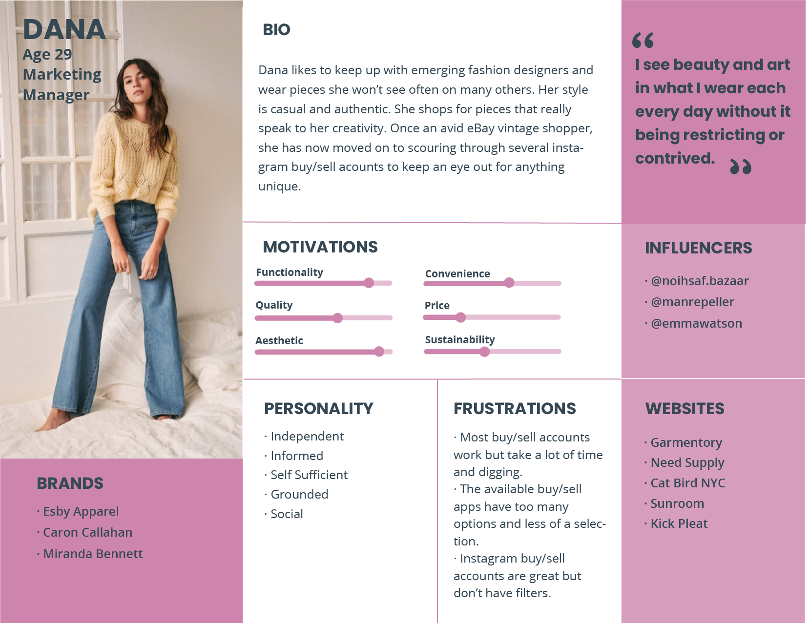
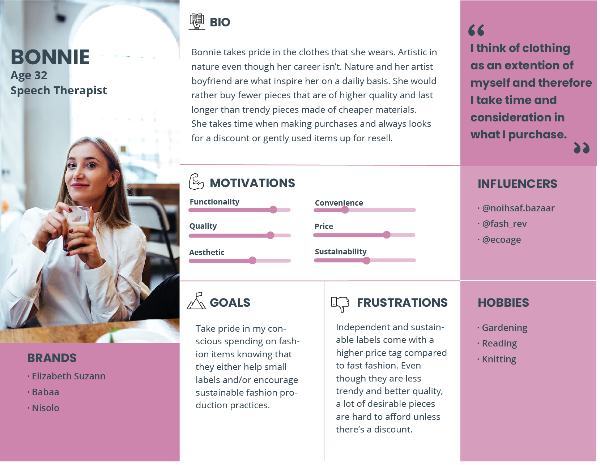
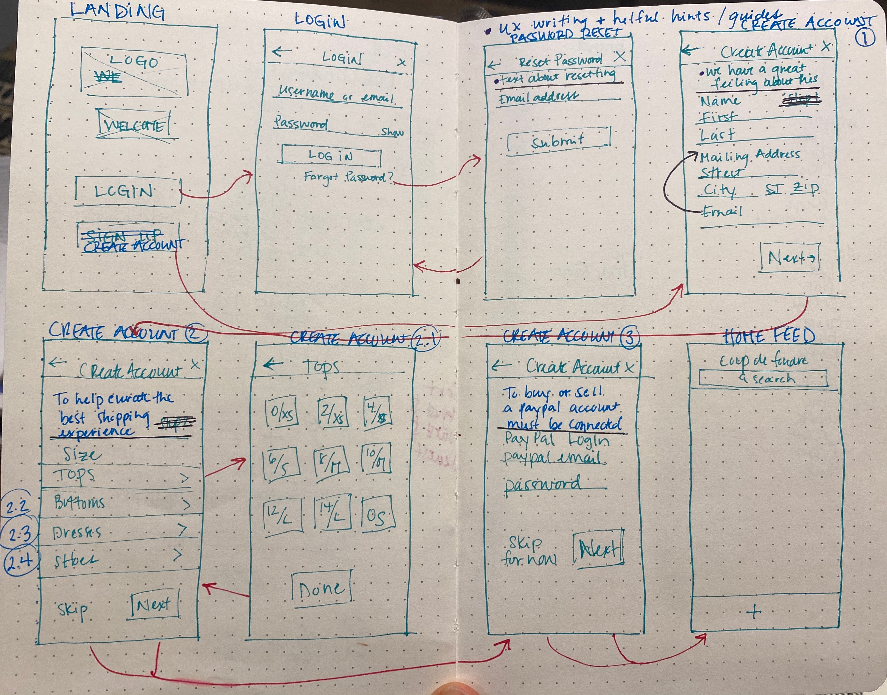
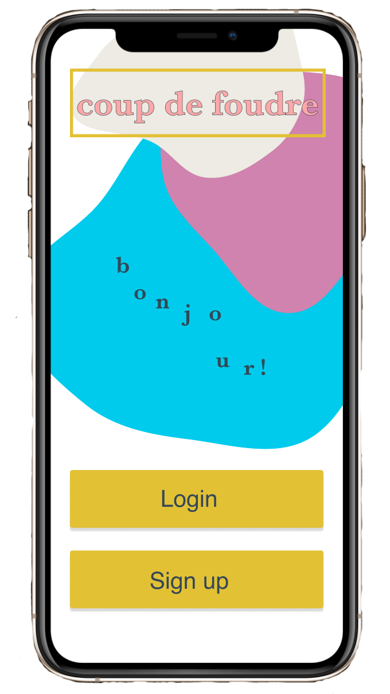
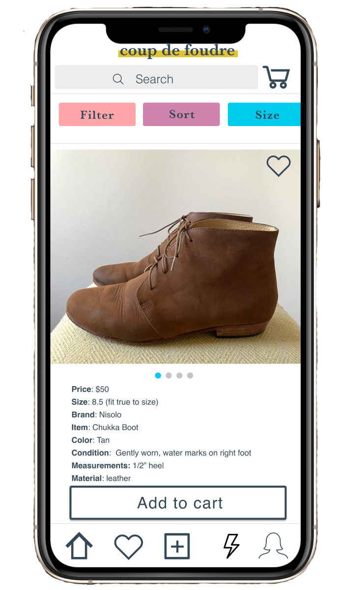
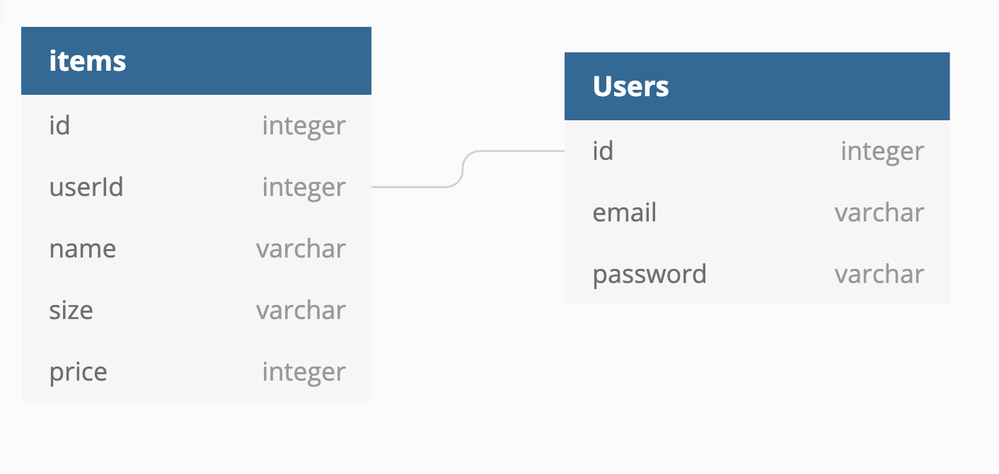

This project was bootstrapped with [Create React App](https://github.com/facebook/create-react-app).

## Coup De Foudre

By Summer Liddington

## Objectives
1. Create a simple and intuitive buy and resale app for this niche market.
2. Simplify choices and options by limited brands, listing information, categories. 

## Challenge Statement
How could we create a simple mobile application for users to buy and sell independent, emerging, and sustainable clothing designer pieces that they own from their closets to others?

## Personas

## Wireframes

## Mockups via Figma

## ERD

## To View:
### `npm start`
How to Run this App
Follow these steps exactly
1. clone this repository.
2. cd into the directory it creates.
3. Make a database.json file in the api directory.
4. Run npm install and wait for all dependencies to be installed.
5. Run npm start to verify that installation was successful

Runs the app in the development mode. 
Open [http://localhost:3000](http://localhost:3000) to view it in the browser.

The page will reload if you make edits. 
You will also see any lint errors in the console.